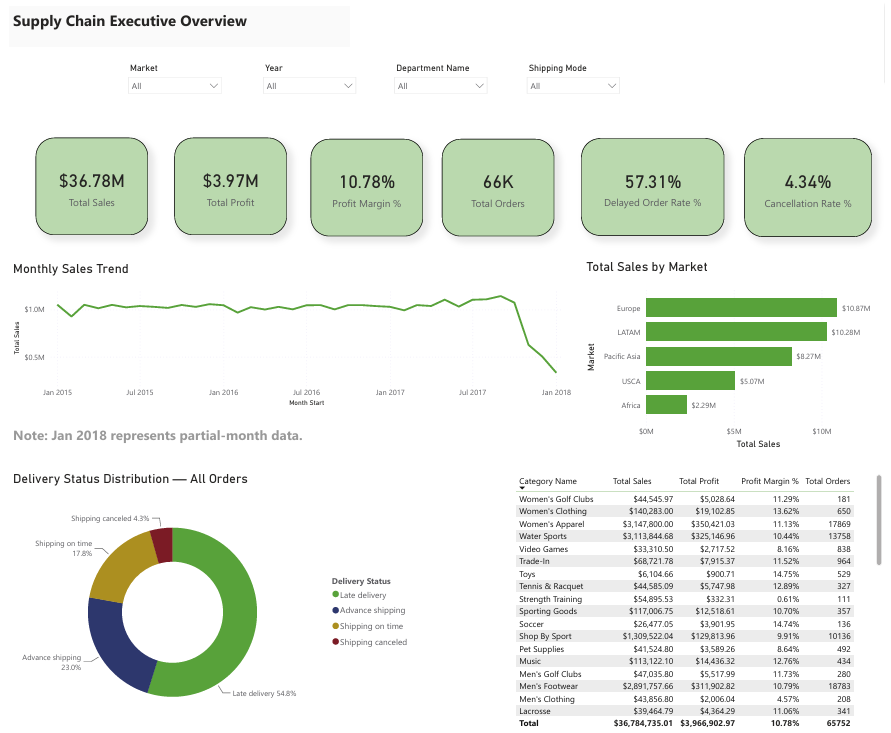
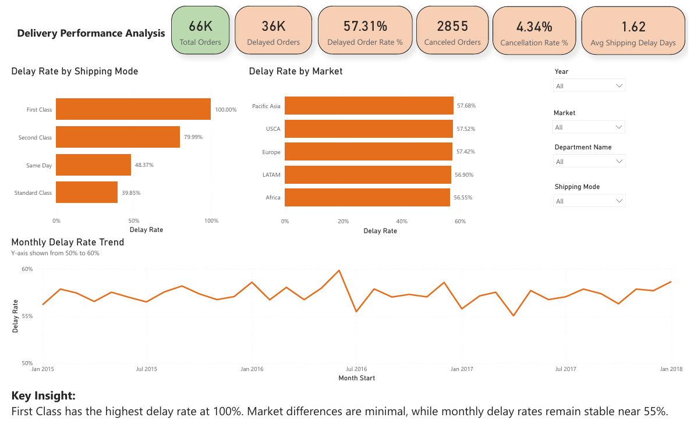
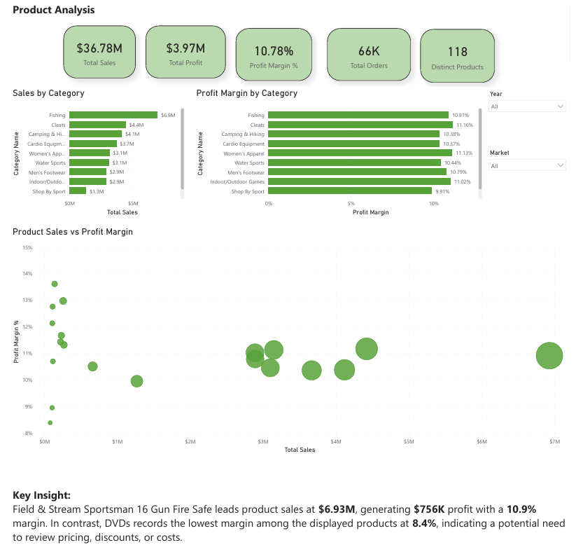
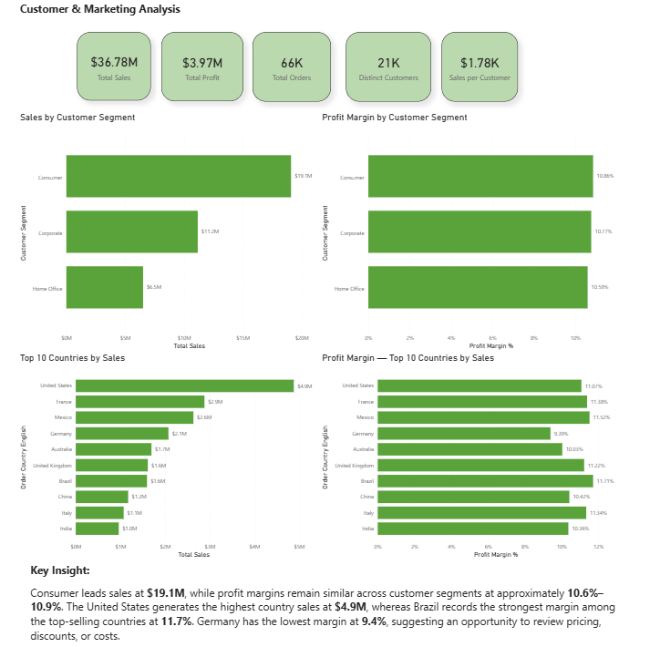
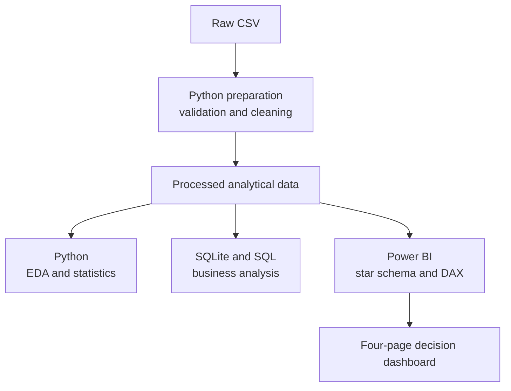
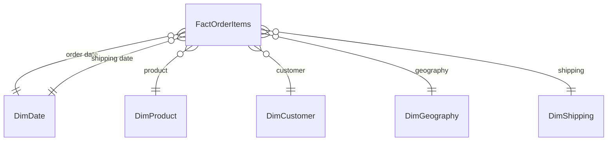
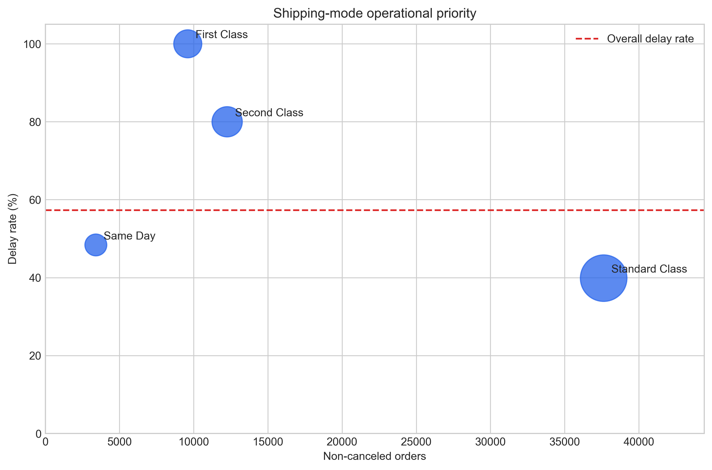

# DataCo Supply Chain Analytics


An end-to-end data analytics project that transforms DataCo's raw order and shipment data into a validated analytical workflow, reusable SQL reporting views, statistical findings, and a four-page interactive Power BI dashboard.

The project analyzes **180,519 order-line records** representing **65,752 distinct orders** from 2015 through January 2018. It helps decision-makers monitor sales, profitability, delivery reliability, product performance, customer segments, and geographic markets.

## Executive Summary

DataCo generated **$36.78M in sales** and **$3.97M in profit**, with a **10.78% profit margin** across the period analyzed. The central operational finding is persistent delivery underperformance: **57.31% of non-canceled orders were delayed**, and the problem appears across markets rather than in one isolated geography.

- **First Class is the highest-severity issue:** all **9,602** observed non-canceled First Class orders were delayed under the dataset's schedule-variance definition. This warrants immediate validation of promised-day rules and fulfillment timestamps.
- **Standard Class is the highest-volume opportunity:** it accounts for **14,995 delayed orders**, or **41.60% of all delays**. A five-percentage-point improvement would correspond to approximately **1,882 fewer delayed orders** at historical volume.
- **Cancellation exposure is concentrated:** estimated canceled-order sales total **$1.57M**, with Fan Shop and Apparel representing more than **67%** of that exposure.
- **Delays were not associated with a meaningful item-level profit difference:** the exploratory Welch test returned **p = 0.0573** and **Cohen's d = 0.0092**. The available data cannot measure delay-related refunds, fulfillment costs, satisfaction, or future churn.

The recommended response is to audit First Class service commitments, target Standard Class for volume-based improvement, strengthen controls in cancellation-sensitive departments, and collect carrier, warehouse, route, inventory, and delay-reason data before making root-cause or causal claims.

## Dashboard Preview

### 1. Executive Overview



Provides a high-level view of commercial and operational performance, including sales, profit, margin, order volume, delay rate, cancellation rate, monthly sales, market performance, and delivery status.

### 2. Delivery Performance Analysis



Compares delay rates by shipping mode and market and tracks monthly delivery performance to identify persistent service-level issues.

### 3. Product Analysis



Evaluates category and product performance using sales, profit, margin, and product-level comparisons to highlight pricing and cost-review opportunities.

### 4. Customer & Market Analysis



Examines customer segments and top-selling countries to compare revenue concentration with profit-margin performance.

## Business Problem

DataCo operates across multiple markets, product categories, customer segments, and shipping modes. Management needs a consistent way to answer the following questions:

- How much revenue and profit does the business generate?
- Which markets, categories, products, and customer segments drive performance?
- How frequently are orders delayed or canceled?
- Which shipping modes and markets have the highest delivery risk?
- Do delayed and on-time fulfilled order items have different average profit?
- Where should the company review service levels, pricing, costs, and fulfillment operations?

## Project Objectives

- Validate and clean the raw supply chain data.
- Build a reproducible SQLite analytical database.
- Measure sales, profit, delivery, and cancellation KPIs.
- Compare logistics performance by shipping mode, market, and time.
- Prioritize delay risks and estimate operational improvement scenarios at the order level.
- Analyze categories, products, customers, and countries.
- Test whether delayed and on-time fulfilled order items have different mean profit.
- Create reusable SQL views for reporting.
- Deliver an interactive, executive-ready Power BI dashboard.

## Dataset

- **Source:** DataCo Smart Supply Chain for Big Data Analysis
- **Publisher:** Mendeley Data
- **Records:** 180,519 order-line records
- **Period:** 2015–January 2018
- **Source link:** [Mendeley Data](https://data.mendeley.com/datasets/8gx2fvg2k6/5)

> The final month is only a partial period. Its lower sales should not be interpreted as a confirmed business decline without controlling for incomplete-month coverage.

## Technology Stack

| Tool | Purpose |
|---|---|
| Python | Data validation, cleaning, exploratory analysis, delay analysis, and statistical testing |
| pandas / SciPy | Data manipulation, descriptive analysis, and hypothesis testing |
| SQLite | Local relational database and analytical storage |
| SQL | KPI calculations, segmentation, risk analysis, and reporting views |
| Power BI | Data modeling, DAX measures, interactive analysis, and visualization |
| Jupyter Notebook | Reproducible data-quality and exploratory-analysis workflow |

## End-to-End Workflow



Python produces the validated analytical dataset used by three parallel consumers. The notebooks perform exploratory and statistical analysis; SQLite and SQL support reproducible business queries and reporting views; and Power BI loads the prepared data into its own star-schema model for DAX calculations and interactive reporting. SQL is therefore an analytical branch—not an implied direct connection between Python and Power BI.

## Data Model

The Power BI model uses a star-schema design. `FactOrderItems`, stored at the order-item grain, is connected to descriptive dimensions for dates, products, customers, geography, and shipping attributes. A dedicated `_Measures` table centralizes reusable DAX calculations.

This design keeps filtering behavior predictable, reduces duplicated calculations, and supports analysis across time, markets, departments, products, customer segments, countries, and shipping modes.



`FactOrderItems` is the model's analytical center. The `_Measures` table is intentionally omitted from the relationship diagram because it stores DAX measures and has no data relationship to the dimensions.

## Core Dashboard KPIs

The dashboard uses two valid views of delivery performance:

- **Delayed Order Rate — Non-Canceled Orders (57.31%)** uses non-canceled distinct orders as the denominator. This is the operational KPI displayed on the delivery page.
- **Late Deliveries — All Orders (54.8%)** uses all distinct orders as the denominator. This is the share displayed in the Executive Overview donut chart.

The exploratory notebook's diagnostic profit comparison uses a different unit of analysis—**non-canceled order items**—while the delay analysis uses **non-canceled distinct orders**. These measures answer different questions and must not be interpreted as if they use the same denominator or grain.

| KPI | Result |
|---|---:|
| Total Sales | **$36.78M** |
| Total Profit | **$3.97M** |
| Profit Margin | **10.78%** |
| Total Orders | **65,752** |
| Delayed Orders | **36K** |
| Delayed Order Rate — Non-Canceled Orders | **57.31%** |
| Late Deliveries — All Orders | **54.8%** |
| Canceled Orders | **2,855** |
| Cancellation Rate | **4.34%** |
| Average Delay Duration — Delayed Non-Canceled Orders | **1.62 days** |
| Distinct Products | **118** |
| Distinct Customers | **21K** |
| Sales per Customer | **$1.78K** |

Values shown above are rounded as displayed in Power BI.

## Selected DAX Measures

```DAX
Total Sales =
SUM(FactOrderItems[Sales])
```

```DAX
Total Profit =
SUM(FactOrderItems[Order Profit Per Order])
```

```DAX
Profit Margin % =
DIVIDE([Total Profit], [Total Sales], 0)
```

```DAX
Total Orders =
DISTINCTCOUNT(FactOrderItems[Order Id])
```

```DAX
Non-Canceled Orders =
CALCULATE(
    DISTINCTCOUNT(FactOrderItems[Order Id]),
    FactOrderItems[is_canceled] = 0
)
```

```DAX
Delayed Orders =
CALCULATE(
    DISTINCTCOUNT(FactOrderItems[Order Id]),
    FactOrderItems[is_delayed] = 1,
    FactOrderItems[is_canceled] = 0
)
```

```DAX
Delayed Order Rate % =
DIVIDE([Delayed Orders], [Non-Canceled Orders], 0)
```

```DAX
Canceled Orders =
CALCULATE(
    DISTINCTCOUNT(FactOrderItems[Order Id]),
    FactOrderItems[is_canceled] = 1
)
```

```DAX
Cancellation Rate % =
DIVIDE([Canceled Orders], [Total Orders], 0)
```

```DAX
Distinct Customers =
COUNTROWS(
    FILTER(
        VALUES(DimCustomer[Customer Id]),
        CALCULATE([Total Orders]) > 0
    )
)
```

```DAX
Sales per Customer =
DIVIDE([Total Sales], [Distinct Customers], 0)
```

> The Power BI model uses cleaned analytical names, so some table and column names differ from the original CSV.

## Key Business Insights

### Sales and profitability

- The business generated **$36.78M** in sales and **$3.97M** in profit, producing a **10.78%** overall profit margin.
- Europe is the largest market at approximately **$10.9M**, followed by LATAM at **$10.3M**.
- Sales remain relatively stable through most of the observed period. The sharp decline at the end of the trend reflects the incomplete January 2018 period and should be interpreted cautiously.

### Delivery performance

- The operational delayed-order rate is **57.31% of non-canceled orders**, indicating a material service-level problem.
- Late deliveries represent **54.8% of all orders** in the Executive Overview distribution.
- First Class has the highest delay rate at **100.0%**, followed by Second Class at **79.99%**.
- Standard Class performs best among the displayed shipping modes, but its **39.85%** delay rate remains substantial.
- Delay rates are similar across markets, ranging from approximately **54.1% to 55.3%**. This suggests a broad operational issue rather than a problem isolated to one market.
- Monthly delay performance stays close to the mid-50% range, showing that delays are persistent rather than caused by a single short-term event.

### Product performance

- Fishing is the leading category by sales at approximately **$6.9M**.
- **Field & Stream Sportsman 16 Gun Fire Safe** is the top-selling displayed product at **$6.93M**, generating approximately **$756K** in profit with a **10.9%** margin.
- DVDs has the lowest margin among the displayed products at **8.4%**, making it a candidate for pricing, discount, and cost review.
- Products with similar sales levels can produce different margins, so revenue alone is not sufficient for product-performance decisions.

### Customers and countries

- The Consumer segment leads sales at **$19.1M**, followed by Corporate at **$11.2M** and Home Office at **$6.5M**.
- Segment margins are tightly grouped between approximately **10.6% and 10.9%**. The sales gap is therefore driven mainly by customer or order volume rather than a major difference in profitability.
- The United States is the highest-sales country at approximately **$4.9M**.
- Among the top ten countries by sales, Brazil has the strongest displayed margin at **11.7%**, while Germany has the lowest at **9.4%**.

## Statistical Analysis

A Welch's two-sample t-test was used to evaluate whether delayed and on-time **non-canceled order items** have different mean profit values. The notebook classifies an item as delayed when actual shipping days exceed scheduled shipping days and excludes canceled items from this comparison.

### Hypotheses

- **Null hypothesis ($H_0$):** Mean profit is equal for delayed and on-time non-canceled order items.
- **Alternative hypothesis ($H_1$):** Mean profit differs between delayed and on-time non-canceled order items.

| Metric | On-Time | Delayed |
|---|---:|---:|
| Mean Profit | $22.58 | $21.62 |

| Welch t-statistic | P-value | Cohen's d | Decision at $\alpha = 0.05$ |
|---:|---:|---:|---|
| 1.9013 | 0.0573 | 0.0092 | Fail to reject $H_0$ |

The observed difference in average profit is not statistically significant at the 5% level. Cohen's $d = 0.0092$ also indicates a negligible effect size. Correlation analysis shows almost no direct relationship between shipping delay and profit margin ($r = -0.005$).

This does **not** mean delays are harmless. Potential effects may appear through cancellations, refunds, additional fulfillment costs, lower customer satisfaction, or future churn; however, these outcomes cannot be measured directly with the available data.

> **Methodological note:** The hypothesis test uses order-item rows. Multiple items may belong to the same order, so the observations may not be fully independent. The result should therefore be treated as exploratory evidence rather than a causal estimate.

## Delay Analysis and Operational Priorities

The order-level analysis compares delay rates and affected order volumes across shipping modes, markets, regions, and time periods. Canceled orders are excluded so the operational delay KPI uses a consistent denominator.

| Shipping Mode | Non-Canceled Orders | Delayed Orders | Delay Rate | Share of All Delays |
|---|---:|---:|---:|---:|
| Standard Class | 37,632 | 14,995 | 39.85% | 41.60% |
| Second Class | 12,256 | 9,803 | 79.99% | 27.19% |
| First Class | 9,602 | 9,602 | 100.00% | 26.64% |
| Same Day | 3,407 | 1,648 | 48.37% | 4.57% |



### Operational Prioritization

The descriptive results provide the clearest basis for business action. First Class requires immediate investigation because every observed non-canceled order was delayed. Standard Class has a lower delay rate but contributes the largest number of delayed orders because it handles the greatest volume. Management should therefore prioritize using both **delay severity** and **affected order volume**, rather than relying on delay rate alone.

Delay rates are also relatively similar across markets. This points to a broad operational issue that may involve service-level rules, order processing, warehouse operations, or carrier handoffs, rather than a problem isolated to one geography.

### Planning Scenarios

The scenarios below hold historical order volume constant and reduce each mode's delay rate by a specified number of percentage points. They are transparent planning estimates, not forecasts or causal claims.

| Shipping Mode | Avoided Delayed Orders at −5 pp | Avoided Delayed Orders at −10 pp |
|---|---:|---:|
| Standard Class | 1,882 | 3,763 |
| Second Class | 613 | 1,226 |
| First Class | 480 | 960 |
| Same Day | 170 | 341 |

Because the source lacks carrier, warehouse, route, inventory, weather, and process-event data, these results should be described as **observed delay patterns and root-cause hypotheses**, not proven root causes.

## Additional SQL Risk Findings

- Estimated canceled-order sales total approximately **$1.57M**.
- Fan Shop accounts for approximately **$0.72M** in canceled sales.
- Apparel accounts for approximately **$0.34M** in canceled sales.
- Fan Shop and Apparel together represent more than **67%** of the identified cancellation exposure.
- Western Europe and Central America have the largest total profit associated with delayed order items, with a combined value above **$0.70M**. This is descriptive exposure, not an estimate of profit lost because of delays.

## Data Limitations and Next Steps

Due to limitations in the available operational and financial variables, this analysis could not identify the root causes of delivery delays or estimate their causal impact on profitability. The current findings should therefore be interpreted as patterns and associations rather than definitive causal conclusions. As a next step, the company should collect more detailed data on carriers, warehouses, routes, fulfillment times, inventory availability, recorded delay reasons, and delay-related costs. This additional data would enable a more rigorous investigation of the root causes and a more accurate assessment of the financial impact of delivery delays.

The dataset is historical and covers the period from 2015 through January 2018. Therefore, the findings demonstrate the analytical workflow and historical patterns in the available data, but should not be interpreted as representing DataCo's current operational performance.

## Recommendations

1. **Audit First Class service commitments immediately.** All 9,602 non-canceled First Class orders were delayed under the dataset's schedule-variance definition. Validate the promised-day rule and trace fulfillment timestamps before changing the service offer.
2. **Prioritize both severity and volume.** First Class has the worst rate, while Standard Class contributes the largest number of delayed orders (14,995). A 5-point Standard Class improvement corresponds to approximately 1,882 fewer delayed orders at historical volume.
3. **Investigate the end-to-end delay process across markets.** Market delay rates are tightly grouped, pointing to a broader issue involving order processing, warehouse operations, carrier handoffs, or delivery-date rules.
4. **Protect cancellation-sensitive departments.** Prioritize inventory availability and fulfillment controls for Fan Shop and Apparel, where canceled sales exposure is concentrated.
5. **Review low-margin products and countries.** Examine pricing, discounting, procurement cost, and fulfillment cost for products such as DVDs and for Germany's top-selling-country segment.
6. **Use both revenue and margin in product decisions.** High sales do not automatically imply strong profitability.
7. **Track complete periods in trend reporting.** Flag or exclude partial months when comparing performance over time.

## Dashboard Features

- Four purpose-built analytical pages
- Interactive slicers for year, market, department, and shipping mode
- Executive KPI cards
- Monthly sales and delay-rate trends
- Market, category, product, segment, and country comparisons
- Top-N product and country analysis
- Product sales-versus-margin scatter analysis
- Consistent cross-filtering through a star-schema model
- Contextual key-insight summaries for business users

## Project Structure

```text
dataco-supplychain-analytics/
├── data/
│   ├── raw/
│   │   └── .gitkeep
│   └── processed/
│       ├── data_quality_dimension_summary.csv
│       ├── data_quality_report.csv
│       ├── delay_pattern_summary.csv
│       ├── delay_improvement_scenarios.csv
│       └── missing_value_summary.csv
├── docs/
│   ├── 01_Executive_Overview.png
│   ├── 02_Delivery_Analysis.png
│   ├── 03_Product_Analysis.png
│   ├── 04_Customer_Market_Analysis.png
│   ├── dataco_supply_chain_dashboard.pbix
│   ├── figures/
│   │   ├── delay_priority.png
│   │   ├── delay_rate_by_shipping_mode.png
│   │   ├── delivery_timing_distribution.png
│   │   ├── monthly_sales_and_profit.png
│   │   ├── top_categories_by_sales.png
│   │   └── top_regions_by_sales.png
│   └── images/
│       └── dataco-supply-chain-analytics-banner.png
├── notebooks/
│   ├── 01_data_preparation_and_quality.ipynb
│   ├── 02_exploratory_analysis.ipynb
│   └── 03_delay_pattern_analysis.ipynb
├── sql/
│   ├── 01_logistics_performance.sql
│   ├── 02_financial_impact_and_risk.sql
│   ├── 03_customer_and_product_segmentation.sql
│   ├── 04_executive_summary_views.sql
│   └── 05_advanced_analytics.sql
├── src/
│   └── data_quality.py
├── .gitignore
├── LICENSE
├── requirements.txt
└── README.md
```

The raw order dataset, cleaned full dataset, and generated SQLite database are intentionally excluded from version control because of their size and because the source data contains customer-related fields that are not needed in a public portfolio repository. Small metadata and quality-summary files remain in the repository. Download the original dataset from the publisher and generate the analytical files locally.

## How to Reproduce

### 1. Clone the repository

```bash
git clone https://github.com/Mo-210/dataco-supplychain-analytics.git
cd dataco-supplychain-analytics
```

### 2. Create an environment and install dependencies

```bash
python -m venv .venv
```

Activate it on Windows:

```powershell
.venv\Scripts\Activate.ps1
```

Install the required packages:

```bash
pip install -r requirements.txt
```

### 3. Download the dataset

Download the dataset from [Mendeley Data](https://data.mendeley.com/datasets/8gx2fvg2k6/5) and place `DataCoSupplyChainDataset.csv` in `data/raw/`.

### 4. Run data preparation and quality checks

```bash
jupyter notebook notebooks/01_data_preparation_and_quality.ipynb
```

The notebook validates and cleans the source data, writes quality-summary files to `data/processed/`, and creates `data/dataco_logistics.db` for SQL analysis.

### 5. Run exploratory and statistical analysis

```bash
jupyter notebook notebooks/02_exploratory_analysis.ipynb
```

### 6. Run delay pattern analysis

Before running SQL, execute the order-level delay pattern analysis:

```bash
jupyter notebook notebooks/03_delay_pattern_analysis.ipynb
```

The notebook writes descriptive pattern summaries and planning scenarios to `data/processed/` and saves its portfolio figures to `docs/figures/`.

### 7. Execute the SQL scripts

Run the scripts against the SQLite database in numerical order:

```text
01_logistics_performance.sql
02_financial_impact_and_risk.sql
03_customer_and_product_segmentation.sql
04_executive_summary_views.sql
05_advanced_analytics.sql
```

Connect to `data/dataco_logistics.db`, execute the scripts in numerical order, and export any reporting views required by Power BI to `data/processed/`.

### 8. Open the Power BI report

1. Open `docs/dataco_supply_chain_dashboard.pbix` in Power BI Desktop.
2. Update the data-source paths if your local folder structure differs.
3. Refresh the model.
4. Use the slicers to explore performance by time, market, department, and shipping mode.

## Repository Deliverables

- Python data-quality module
- Reproducible Jupyter notebooks
- SQLite analytical workflow
- Five SQL analysis and reporting scripts
- Power BI dashboard file
- Four portfolio-ready dashboard previews
- Documented findings and business recommendations

## Author

**Mohammed H**  
Data Analytics

## License

The project code is available under the [MIT License](LICENSE). The source dataset is not covered by this license and remains subject to the terms provided by its original publisher.
